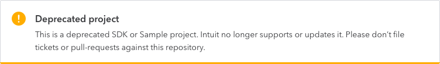

## Deprecated Repo  ( * this is deprecated repo * )
OAuthHangoutSamples for Oauth1 app- (obsolete- Use https://github.com/IntuitDeveloper/C2QB-library-for-Windows-CUI-and-GUI)
===================

Samples from the IPP Google Hangout covering OAuth.
Use the latest IE browser version to test this.
.Net Framework 4.6.1 required

Before Starting
===================

Before using this sample app, dowload the latest version of IE on your machine.
Set your application keys in the application's config file.
Replace the encryption key for your application.  Search for StringCipher.Encrypt and replace the value (e.g., "FILL_IN_USER_PASSWORD_OR_OTHER_UNIQUE_USER_VALUE")
